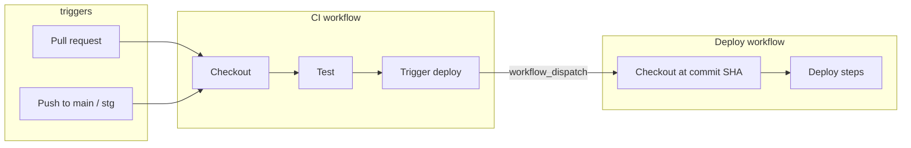

# GitHub Actions CI/CD Template

A minimal, production-minded GitHub Actions setup that separates **continuous integration** from **deployment**. CI runs on every pull request and protected-branch push; deploy runs only when CI succeeds on `main` or `stg`, with per-branch concurrency so the latest commit always wins.

Built as a reusable template — swap the placeholder steps for your tests, builds, and deploy commands.

---

## How it works



| Event | CI runs | Deploy triggered |
|-------|---------|------------------|
| Pull request | Yes | No |
| Push to `main` | Yes | Yes (after CI passes) |
| Push to `stg` | Yes | Yes (after CI passes) |
| Manual `workflow_dispatch` | — | Yes (via Actions UI) |

---

## Workflows

### [`ci.yaml`](.github/workflows/ci.yaml)

Runs on pull requests and pushes to `main` / `stg`.

1. **Checkout** — clones the repository at the triggering ref.
2. **Test** — placeholder step; replace with lint, unit tests, build, etc.
3. **Trigger deploy** — on push to `main` or `stg` only, dispatches the Deploy workflow via the GitHub API with the commit SHA and branch name.

```yaml
# Deploy is triggered only after CI succeeds on protected branches
if: github.event_name == 'push' && (github.ref == 'refs/heads/main' || github.ref == 'refs/heads/stg')
```

`permissions.actions: write` is required so `GITHUB_TOKEN` can dispatch the deploy workflow.

### [`deploy.yaml`](.github/workflows/deploy.yaml)

Manually dispatchable (`workflow_dispatch`) with two inputs:

| Input | Description |
|-------|-------------|
| `ref` | Commit SHA to deploy |
| `branch` | Target environment branch (`main`, `stg`, …) |

**Concurrency** — one deploy per branch at a time; a newer run cancels any in-progress deploy for the same branch:

```yaml
concurrency:
  group: ${{ github.workflow }}-${{ inputs.branch }}
  cancel-in-progress: true
```

This avoids race conditions when commits land in quick succession.

---

## Design choices

**Why split CI and deploy?**

- CI stays fast and focused on validation.
- Deploy can be retried or run manually without re-running tests.
- Deploy permissions and secrets can be scoped separately (e.g. environment protection rules on `main`).

**Why `workflow_dispatch` instead of `workflow_call`?**

- Deploy appears as its own workflow in the Actions tab — easy to inspect, retry, and audit.
- Manual deploys from the UI work out of the box with the same inputs CI passes automatically.

**Why pass `ref` (SHA) and `branch`?**

- `ref` pins the exact commit being deployed — reproducible and traceable.
- `branch` drives concurrency grouping and can map to environments (`main` → production, `stg` → staging).

---

## Getting started

1. Copy `.github/workflows/` into your repository.
2. Replace the **Test step** in `ci.yaml` with your actual CI pipeline.
3. Replace the **Print deploy inputs** step in `deploy.yaml` with your deploy logic (e.g. `docker build`, `kubectl apply`, `terraform apply`).
4. Adjust branch names in both files if you use something other than `main` / `stg`.
5. (Optional) Add [GitHub Environments](https://docs.github.com/en/actions/deployment/targeting-different-environments/using-environments-for-deployment) with required reviewers or secrets per branch.

No extra secrets are needed for CI → deploy chaining; the default `GITHUB_TOKEN` is sufficient when `actions: write` is granted.

---

## Adapting the template

**Add more environments** — extend the `branches` list in `ci.yaml` and the deploy trigger condition:

```yaml
push:
  branches: [main, stg, dev]
```

**Gate deploy on tests** — the trigger step already runs after all prior steps succeed. Add jobs or a `needs:` chain as your pipeline grows.

**Use reusable workflows** — once the pattern is stable, extract shared steps into `workflow_call` workflows and keep this split as the orchestration layer.

---

## File structure

```
.github/
└── workflows/
    ├── ci.yaml       # Validate on PR + push; trigger deploy on main/stg
    └── deploy.yaml   # Deploy a specific commit to a branch/environment
```

---

## License

Use freely in your own projects. Attribution appreciated but not required.
